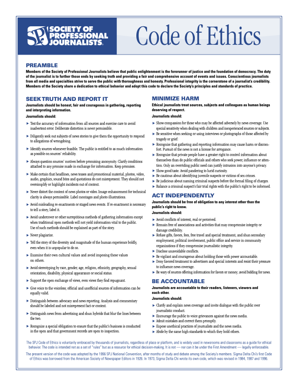

# Code of Ethics

- [Original document (PDF)](https://www.spj.org/pdf/ethicscode.pdf)
- [Society of Professional Journalists](https://www.spj.org/)

## Preamble

Members of the Society of Professional Journalists believe that public enlightenment is the forerunner of justice and the foundation of democracy.
The duty of the journalist is to further those ends by seeking truth and providing a fair and comprehensive account of events and issues.
Conscientious journalists from all media and specialties strive to serve the public with thoroughness and honesty.
Professional integrity is the cornerstone of a journalist&rsquo;s credibility.
Members of the Society share a dedication to ethical behavior and adopt this code to declare the Society&rsquo;s principles and standards of practice.

## Seek Truth and Report It

Journalists should be honest, fair and courageous in gathering, reporting and interpreting information.

Journalists should:

- Test the accuracy of information from all sources and exercise care to avoid inadvertent error. Deliberate distortion is never permissible.
- Diligently seek out subjects of news stories to give them the opportunity to respond to allegations of wrongdoing.
- Identify sources whenever feasible. The public is entitled to as much information as possible on sources&rsquo; reliability.
- Always question sources&rsquo; motives before promising anonymity. Clarify conditions attached to any promise made in exchange for information. Keep promises.
- Make certain that headlines, news teases and promotional material, photos, video, audio, graphics, sound bites and quotations do not misrepresent. They should not oversimplify or highlight incidents out of context.
- Never distort the content of news photos or video. Image enhancement for technical clarity is always permissible. Label montages and photo illustrations.
- Avoid misleading re-enactments or staged news events. If re-enactment is necessary to tell a story, label it.
- Avoid undercover or other surreptitious methods of gathering information except when traditional open methods will not yield information vital to the public. Use of such methods should be explained as part of the story.
- Never plagiarize.
- Tell the story of the diversity and magnitude of the human experience boldly, even when it is unpopular to do so.
- Examine their own cultural values and avoid imposing those values on others.
- Avoid stereotyping by race, gender, age, religion, ethnicity, geography, sexual orientation, disability, physical appearance or social status.
- Support the open exchange of views, even views they find repugnant.
- Give voice to the voiceless; official and unofficial sources of information can be equally valid.
- Distinguish between advocacy and news reporting. Analysis and commentary should be labeled and not misrepresent fact or context.
- Distinguish news from advertising and shun hybrids that blur the lines between the two.
- Recognize a special obligation to ensure that the public&rsquo;s business is conducted in the open and that government records are open to inspection.

## Minimize Harm

Ethical journalists treat sources, subjects and colleagues as human beings deserving of respect.

Journalists should:

- Show compassion for those who may be affected adversely by news coverage. Use special sensitivity when dealing with children and inexperienced sources or subjects.
- Be sensitive when seeking or using interviews or photographs of those affected by tragedy or grief:
- Recognize that gathering and reporting information may cause harm or discomfort. Pursuit of the news is not a license for arrogance.
- Recognize that private people have a greater right to control information about themselves than do public officials and others who seek power, influence or attention. Only an overriding public need can justify intrusion into anyone&rsquo;s privacy.
- Show good taste. Avoid pandering to lurid curiosity.
- Be cautious about identifying juvenile suspects or victims of sex crimes.
- Be judicious about naming criminal suspects before the formal filing of charges.
- Balance a criminal suspect&rsquo;s fair trial rights with the public&rsquo;s right to be informed.

## Act Independently

Journalists should be free of obligation to any interest other than the public&rsquo;s right to know.

Journalists should:

- Avoid conflicts of interest, real or perceived.
- Remain free of associations and activities that may compromise integrity or damage credibility.
- Refuse gifts, favors, fees, free travel and special treatment, and shun secondary employment, political involvement, public office and service in community organizations if they compromise journalistic integrity.
- Disclose unavoidable conflicts.
- Be vigilant and courageous about holding those with power accountable.
- Deny favored treatment to advertisers and special interests and resist their pressure to influence news coverage.
- Be wary of sources offering information for favors or money; avoid bidding for news.

## Be Accountable

Journalists are accountable to their readers, listeners, viewers and each other.

Journalists should:

- Clarify and explain news coverage and invite dialogue with the public over journalistic conduct.
- Encourage the public to voice grievances against the news media.
- Admit mistakes and correct them promptly.
- Expose unethical practices of journalists and the news media.
- Abide by the same high standards to which they hold others.

---

The SPJ Code of Ethics is voluntarily embraced by thousands of journalists, regardless of place or platform, and is widely used in newsrooms and classrooms as a guide for ethical behavior. The code is intended not as a set of “rules” but as a resource for ethical decision-making. It is not - nor can it be under the First Amendment - legally enforceable.

The present version of the code was adopted by the 1996 SPJ National Convention, after months of study and debate among the Society&rsquo;s members.
Sigma Delta Chi&rsquo;s first Code of Ethics was borrowed from the American Society of Newspaper Editors in 1926. In 1973, Sigma Delta Chi wrote its own code, which was revised in 1984, 1987 and 1996.
